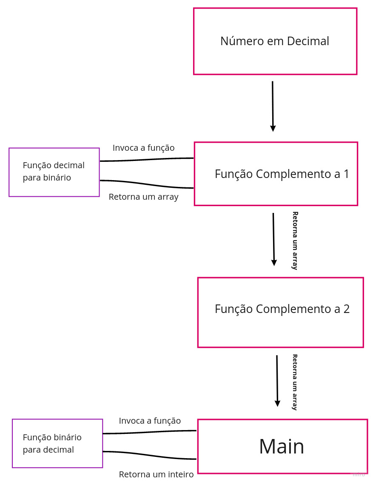

 

# Como executar
- Se quiser executar no PC, basta instalar o <a href="https://nodejs.org/en/">node</a> e executar no terminal: "node main.js".

- Ou se preferir pode acessar <a href="https://replit.com/join/ljxkdqhegp-bcaua321">Replit</a>.
